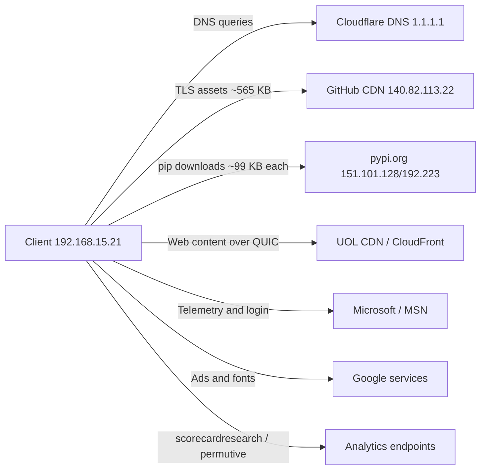

# gSage AI SOC Prompt Examples

This document contains curated prompt/response examples from real interactions with the assistant. Timestamps and transient progress messages were removed for readability. Workflow notes are included only when they help explain a multi-step task.

## Capability Summaries

### Example 1. Tool Overview in a Table

**Prompt**

> What are you capable of? List your tools concisely in a table.

**Response**

Here's a concise overview of my capabilities as gSage AI - Cybersecurity Analyst Assistant:

| Category | Capabilities |
| --- | --- |
| DNS & Domain | dns_lookup - resolve A/AAAA/MX/TXT/NS/CNAME/SOA records, reverse PTR, DNSBL blacklist checks; domain_security_audit - SPF, DMARC, DNSSEC, STARTTLS, DANE, MTA-STS, TLS-RPT, BIMI, CAA, TLS certificate |
| Threat Intel | threat_intel_lookup - query VirusTotal and AbuseIPDB for IPs, domains, URLs, file hashes; discoverable: CISA KEV, MSRC bulletins, NVD, curator lists |
| Email Security | eml_analyzer - static .eml analysis (headers, SPF/DKIM/DMARC verdicts, phishing indicators, attachments, URLs) |
| Network Scanning | nmap_scan - TCP port scans (quick/service/full modes) with service version and OS detection |
| File Analysis | read_file - read text attachments; discoverable: pdf_analyzer, zip_tool |
| Document Generation | generate_document - create reports from templates (DOCX/PDF/HTML/MD) |
| Knowledge Base | search_knowledge_base / add_to_knowledge_base - search and store internal facts, policies, procedures |
| Tool Discovery | search_tools - find additional tools by keyword (ITSM/GLPI, EDR, firewall, email, monitoring, etc.) |
| Diagrams | mermaid_reference / mermaid_validate - create validated flowcharts, sequence diagrams, timelines, sankey diagrams, and more |

**Discoverable tools**

- ITSM: GLPI ticket management (create, search, update)
- EDR: endpoint management and security events
- Firewall: IP blocking
- Network: WHOIS/RDAP, IP geolocation, PCAP analysis, WhatWeb fingerprinting
- Monitoring: Elasticsearch/Kibana (ELK), Zabbix queries
- Admin: Active Directory read/write, user/group management

All actions support audit context tracking (reason, ticket ID, severity). Need me to investigate something?

### Example 2. Tool Overview in a Single Paragraph

**Prompt**

> What are you capable of? List your tools concisely in a single paragraph.

**Response**

I'm a cybersecurity analyst assistant with the following core capabilities at your disposal: Network and DNS - resolve DNS records (A, AAAA, MX, TXT, NS, CNAME, SOA), check domain blacklists, perform comprehensive domain security audits (SPF, DMARC, DNSSEC, MTA-STS, BIMI, CAA, TLS certs), and scan ports/services with Nmap (quick/service/full modes). Threat Intelligence - look up IPs, domains, URLs, and file hashes against VirusTotal and AbuseIPDB, query NVD/CISA KEV for CVEs, and search MSRC bulletins. Email and File Analysis - static analysis of .eml files for phishing/spoofing (header anomalies, URL analysis, attachment inspection), read text attachments, and generate documents from templates (DOCX, PDF, HTML, MD). Data Management - persistent key-value datastores (CRUD, query, bulk operations), knowledge base CRUD/search, and Wiki.js page management. Integration and Workflow - GLPI ticketing (create/update/search), GravityZone EDR (endpoint isolation, blocklist, incident management), firewall IP blocking, Zabbix monitoring queries, Elasticsearch log search, SSH command execution, IP geolocation, RDAP lookups, WhatWeb web fingerprinting, PCAP analysis, and scheduled job management - plus base64 decode and PDF analysis utilities.

## Threat Intelligence

### Example 3. Suspicious Hash Lookup

**Prompt**

> Look up intelligence on the suspicious hash f211694aaf443b12b2eca9f5e7f25407. Be concise.

**Workflow note**

- threat_intel_lookup - IOC: f211694aaf443b12b2eca9f5e7f25407

**Response**

#### Threat Intel - f211694aaf443b12b2eca9f5e7f25407

| Attribute | Value |
| --- | --- |
| Hash Type | MD5 |
| File Name | pulwama.rar |
| File Type | RAR archive |
| Size | ~155 KB |
| VT Detections | 42 / 62 engines flagged as malicious |
| Verdict | MALICIOUS |

**Key classifications**

- Kaspersky: Trojan-Downloader.Win32.Agent.gzkf
- ESET: Win32/TrojanDownloader.Agent.RDA
- BitDefender / Arcabit: Gen:Variant.Doina.40979
- Cynet: Malicious (score: 99)
- Sophos: Mal/Generic-S
- ClamAV: Win.Trojan.Upero-1

**Summary**

This RAR archive (pulwama.rar) is a trojan downloader. It drops or fetches additional payloads onto the victim's system. The high detection rate across major vendors confirms it as a known threat.

**Recommended actions**

- Block this hash at the endpoint and email gateway.
- If observed on any internal asset, investigate post-execution artifacts such as network connections, dropped files, and persistence.

### Example 4. Suspicious IP Lookup

**Prompt**

> Check intelligence on the IP address 84.54.23.137.

**Workflow note**

- threat_intel_lookup - IOC: 84.54.23.137, IOC type: ip

**Response**

#### Threat Intel - 84.54.23.137

| Attribute | Value |
| --- | --- |
| ASN | AS51167 - Contabo GmbH |
| Network | 84.54.23.0/24 |
| Country | France |
| ISP | Contabo GmbH |
| Usage | Data center / web hosting |
| AbuseIPDB Score | 67 / 100 (119 reports, 64 reporters) |
| VT Detections | 3 malicious / 4 suspicious / 52 harmless |

**Reported attack types**

- DDoS attack
- Open proxy
- Web spam
- Port scan
- Hacking
- SQL injection
- Brute force
- Bad web bot
- Exploited host
- Web app attack

**Summary**

This IP hosted at Contabo (France) is a multi-purpose malicious host with a high abuse confidence score and a broad range of reported attacks. It has been flagged for brute force, port scanning, SQL injection, DDoS, and web application attacks by 64 distinct reporters.

**Verdict**

MALICIOUS - handle with caution.

**Recommended actions**

- Block it at the perimeter firewall or WAF.
- Review logs for any connections to or from this IP within your environment.
- If found in outbound traffic, investigate for possible C2 callback or data exfiltration.

## Vulnerability Intelligence

### Example 5. Recent Microsoft Bulletins

**Prompt**

> List recent information about Microsoft bulletins from the last 7 days.

**Workflow notes**

- search_tools - query: Microsoft security bulletin MSRC
- run discovered tool - msrc_bulletin with month 2026-Apr and max_results 50

**Response**

Here are the key highlights from the April 2026 MSRC Patch Tuesday bulletin (658 total vulnerabilities). Below is a curated view of the most critical items.

**Top critical vulnerabilities (CVSS >= 9.0)**

| CVE ID | Title | Impact | CVSS | Exploited? |
| --- | --- | --- | --- | --- |
| CVE-2026-33819 | Microsoft Bing RCE | Remote Code Execution | 10.0 | No |
| CVE-2026-35431 | Microsoft Entra ID Entitlement Mgmt Spoofing | Spoofing | 10.0 | No |
| CVE-2026-40175 | Axios Cloud Metadata Exfiltration (Header Injection) | RCE | 10.0 | No |
| CVE-2026-21515 | Azure IoT Central EoP | Elevation of Privilege | 9.9 | No |
| CVE-2026-33824 | Windows IKE Service RCE | Remote Code Execution | 9.8 | No |
| CVE-2026-24303 | Microsoft Partner Center EoP | Elevation of Privilege | 9.6 | No |
| CVE-2026-32210 | Microsoft Dynamics 365 (online) Spoofing | Spoofing | 9.3 | No |
| CVE-2026-33102 | Microsoft 365 Copilot EoP | Elevation of Privilege | 9.3 | No |

**Critical Windows and infrastructure highlights**

| CVE | Title | Affected Products |
| --- | --- | --- |
| CVE-2026-33824 | Windows IKE Service RCE | Windows 10/11 (all versions), Server 2019-2025 - patches via KB5082123, KB5082142, etc. |
| CVE-2026-33827 | Windows TCP/IP RCE | Windows 10/11, Server 2019-2025 - requires adjacent network access, but still critical |
| CVE-2026-33826 | Windows Active Directory RCE | Server 2016-2025 (domain controller patching priority) |
| CVE-2026-32157 | Remote Desktop Client RCE | Windows App Client and all supported Windows versions |
| CVE-2026-32190 | Microsoft Office RCE | Office 2016, 2019, LTSC 2021/2024, Microsoft 365 Apps |
| CVE-2026-33114/15 | Microsoft Word RCE (x2) | Microsoft 365 Apps, Office LTSC 2021/2024 |

**Important vulnerabilities worth noting**

| CVE | Title | CVSS |
| --- | --- | --- |
| CVE-2026-33120 | Microsoft SQL Server 2022 RCE (GDR) | 8.8 |
| CVE-2026-40372 | ASP.NET Core 10.0 EoP | 9.1 |
| CVE-2026-26178 | Windows Advanced Rasterization Platform EoP | 8.8 |
| CVE-2026-32225 | Windows Shell Security Feature Bypass | 8.8 |
| CVE-2026-26167 | Windows Push Notifications EoP | 8.8 |

**Key takeaways**

- No actively exploited zero-days appear in this batch.
- Top patch priority: Windows IKE Service RCE (CVE-2026-33824) and Active Directory RCE (CVE-2026-33826).
- Three CVSS 10.0 vulnerabilities stand out: Bing, Entra ID, and a third-party Axios-related cloud metadata issue.
- Office and Word include three critical RCE bugs, so endpoint patching should be prioritized.

Need a deeper look at any specific CVE or product category?

### Example 6. Specific CVE Follow-Up

**Prompt**

> Show details for CVE-2026-33120.

**Workflow note**

- run discovered tool - msrc_bulletin with cve_id CVE-2026-33120 and max_results 1

**Response**

#### CVE-2026-33120 - Microsoft SQL Server Remote Code Execution

| Field | Value |
| --- | --- |
| Title | Microsoft SQL Server Remote Code Execution Vulnerability |
| Severity | Important |
| CVSS Score | 8.8 (High) |
| Vector | AV:N/AC:L/PR:L/UI:N/S:U/C:H/I:H/A:H |
| CWE | CWE-822 - Untrusted Pointer Dereference |
| Impact | Remote Code Execution |
| Exploited in the Wild | No |
| Publicly Disclosed | No |

**Details**

- Affected product: Microsoft SQL Server 2022 for x64-based Systems (GDR)
- Attack vector: network-accessible, low complexity; an authenticated attacker with low privileges can trigger remote code execution without user interaction
- Impact: full compromise of confidentiality, integrity, and availability

**Remediation**

| KB Article | Link |
| --- | --- |
| KB5084815 | Microsoft Download Center |

**Priority assessment**

While rated Important rather than Critical, the CVSS 8.8 score reflects a network-based, low-complexity path that requires only low-privilege credentials. If an attacker already has a foothold, they can use this issue to gain full control of the SQL Server instance.

**Recommended actions**

- Patch immediately by applying KB5084815 to all SQL Server 2022 GDR instances.
- Verify which SQL Server instances are unnecessarily exposed to the network.
- Audit low-privilege SQL logins that should not exist.
- Enable Windows and MSSQL logging to watch for post-exploitation activity after patching.

## Platform Coverage

### Example 7. BitDefender GravityZone and GLPI Capabilities

**Prompt**

> Describe what you can do in BitDefender GravityZone (GV) and GLPI. Present it in a table.

**Workflow notes**

- search_tools - query: GravityZone BitDefender EDR
- search_tools - query: GLPI ticket ITSM

**Response**

Here's a breakdown of what I can do in BitDefender GravityZone and GLPI.

#### BitDefender GravityZone

**Read-only (no approval needed)**

| Tool | Action | Description |
| --- | --- | --- |
| gz_endpoints | list | List all managed/unmanaged endpoints with filters (name, IP, CIDR, MAC), paginate up to 1000 per page |
| gz_endpoints | details | Retrieve a full endpoint record by ID, including agent status, OS, last seen, and installed modules |
| gz_security | blocklist_items | View all blocklist rules (hash, path, connection) |
| phasr_recommendations | - | PHASR policy recommendations for a company, filterable by category, status, and type |
| phasr_resources | - | Behavioral profile resources |
| phasr_identities | - | Behavioral profile identities |

**Write / action (requires approval)**

| Tool | Action | Description |
| --- | --- | --- |
| gz_management | add_to_blocklist | Block a hash (MD5/SHA256), file path, or network connection rule |
| gz_management | remove_from_blocklist | Remove blocklist entries by ID |
| gz_management | isolate_endpoint | Isolate an endpoint from the network |
| gz_management | restore_isolation | Restore network access for an isolated endpoint |
| gz_management | change_incident_status | Update security incident status (open/investigating/closed/false_positive) |
| gz_management | update_incident_note | Add or update notes on an incident |

#### GLPI

**Read-only (no approval needed)**

| Tool | Action | Description |
| --- | --- | --- |
| glpi_search | search | Search any item type (Ticket, Computer, User, Software, etc.) with quick search, keyword, status, priority, date range, and advanced criteria |
| glpi_search | list_fields | Discover valid field IDs for advanced search criteria |
| glpi_get_item | - | Fetch a full item by ID (ticket, asset, user, etc.) with sub-items such as follow-ups, solutions, tasks, logs, and documents |
| glpi_get_group_members | - | List members of a GLPI group, with optional recursive subgroup traversal |

**Write / action (requires approval)**

| Tool | Action | Description |
| --- | --- | --- |
| glpi_create_ticket | - | Create a new incident or service request (title, description, priority, category, assignment, location) |
| glpi_update_ticket | update | Modify title, description, status, priority, urgency, impact, or category |
| glpi_update_ticket | add_followup | Add a public or private comment to a ticket |
| glpi_update_ticket | add_solution | Record a resolution description |
| glpi_update_ticket | assign | Assign a technician user and/or group |
| glpi_update_ticket | close | Close a ticket with solution content |
| glpi_update_ticket | escalate_priority | Escalate a ticket's priority level |

**Summary**

| Platform | Read (no approval) | Write (requires approval) |
| --- | --- | --- |
| GravityZone | Endpoint inventory, blocklist audit, PHASR recommendations | Block/unblock rules, isolate/restore endpoints, manage incidents |
| GLPI | Search item types, view full records, list group members | Create tickets, update/assign/close/escalate, add follow-ups and solutions |

Want me to query anything from either platform now?

## Investigations and Analysis

### Example 8. PCAP Analysis with a Graph

**Prompt**

> Analyze the attached PCAP and present a graph.

**Workflow notes**

- Start with an overview pass to identify the main traffic profile.
- Run a security analysis to check for anomalies.
- Extract DNS and HTTPS details to confirm hostnames.
- Validate the graph structure before presenting it.

**Response**

#### PCAP Analysis - test.pcap (3.1 MB, 11.2 seconds)

**General overview**

| Metric | Value |
| --- | --- |
| Total Packets | 5,895 |
| Total Bytes | ~3.1 MB |
| Duration | 11.2 seconds |
| Active Hosts (LAN) | 192.168.15.21 (main) plus 10+ local devices |
| DNS Server | 1.1.1.1 (Cloudflare) |
| Security Alerts | None detected - clean capture |

**Traffic graph**

**Protocol distribution**

| Protocol | Packets | Notes |
| --- | --- | --- |
| TLS 1.2 / 1.3 / SSL | ~2,641 | Encrypted web traffic dominates the capture |
| DNS | 716 | Heavy DNS activity to 1.1.1.1 |
| QUIC | 548 | Google/YouTube/UOL traffic over HTTP/3 |
| TCP (bare) | 1,817 | Connection setup and teardown |
| ARP / MDNS / SSDP | ~116 | Local network discovery |
| HTTP | 2 | Only one GET request plus UPnP M-SEARCH |

**Main hosts and identified services**

| Source | Destination | Service | Volume |
| --- | --- | --- | --- |
| GitHub CDN (140.82.113.22) | 192.168.15.21:41066 | TLS GitHub API/assets | #1 (~565 KB) |
| 192.168.15.21 | Microsoft (20.42.73.30) | browser.events.data.msn.com | ~163 KB |
| 192.168.15.21 | pypi.org (151.101.128/192.223) | pip/Python packages | ~99 KB each |
| 192.168.15.21 | Cloudflare 1.1.1.1:53 | DNS resolution | ~43 KB |
| Client IPv6 | UOL CDN (CloudFront) | www.uol.com.br content | Heavy |
| Client IPv6 | Google | Ads (securepubads), fonts | Heavy |
| Client IPv6 | Microsoft/MSN | Bing, MSN, login, telemetry | Moderate |

**Top DNS queries**

| Domain | Count |
| --- | --- |
| sb.scorecardresearch.com | 11 |
| www.bing.com, c.msn.com, login.microsoftonline.com, assets.msn.com, r.bing.com | 6 each |
| www.uol.com.br, tm.jsuol.com.br, conteudo.jsuol.com.br | 6 each |
| securepubads.g.doubleclick.net | 6 |
| fonts.googleapis.com | 6 |
| 4b91477e...edge.permutive.app | 6 |

**Interpretation**

- This looks like a standard user browsing session on a dual-stack Windows machine at 192.168.15.21.
- GitHub traffic is the largest flow and likely reflects a git clone or large asset download.
- UOL content is being loaded heavily over CloudFront and QUIC.
- Microsoft traffic includes Bing, MSN, telemetry, and login activity.
- pypi.org traffic indicates Python package downloads.
- No security alerts were detected; the capture appears clean.

Want a deeper look at any specific flow, such as DNS, TLS handshakes, or the GitHub conversation?

### Example 9. Contextual Authentication Overview

**Prompt**

> What do you know about Contextual Authentication?

**Workflow note**

- search_knowledge_base - query: Contextual Authentication

**Response**

#### Contextual Authentication - What It Is

Contextual Authentication, also called risk-based adaptive authentication, is a security approach that evaluates the full context of each login attempt in real time to decide whether to allow, block, or request additional authentication factors.

Instead of always prompting for MFA, it analyzes variables such as the following.

| Factor | Examples |
| --- | --- |
| Geographic | Country, region, time zone, distance from the last login |
| Behavioral | Typical access hours, typing speed, browsing patterns |
| Device | Browser fingerprint, operating system, IP address, network |
| Reputation | Blacklisted IPs, VPN/proxy/Tor detection, leaked credentials |
| Historical | First access, abrupt location changes, recent failed attempts |

**How it works (risk scoring)**

| Risk Level | Action |
| --- | --- |
| Low | Access granted with no friction |
| Medium | Prompt for MFA (TOTP, email, SMS) |
| High / Critical | Block or require manual approval |

**GuardianKey Auth Security - implementation example**

According to the referenced whitepaper, GuardianKey Auth Security implements this model by combining AI, behavioral profiling, and threat intelligence to assign a risk score to each authentication attempt.

**Integration methods**

- Reverse proxy - intercepts logins without changing application code
- Cloudflare Worker - edge-level protection with low latency
- SDKs/APIs - PHP, Python, Node.js, Java, ASP, and others

**Benefits vs. static MFA**

| Characteristic | Traditional MFA | Contextual Authentication |
| --- | --- | --- |
| User always authenticates? | Yes | Only when needed |
| User experience | Constant friction | More transparent |
| Detects anomalies | No | Yes |
| Adapts to risk | Fixed | Dynamic |
| Compliance (LGPD, PCI, ISO) | Partial | Stronger coverage |

**Common use cases**

- Government portals - security without compromising citizen experience
- Corporate SaaS - protection against unauthorized access
- Healthcare and education - sensitive access control with compliance requirements
- Financial institutions - real-time fraud prevention
- Legacy systems - adaptive MFA without modifying application code

Would you like to go deeper into a specific area, such as Cloudflare Worker implementation or configurable risk policies?

### Example 10. Translation Follow-Up

**Prompt**

> Translate the previous answer to English.

**Response**

#### Contextual Authentication - English Version

Contextual Authentication, also called risk-based adaptive authentication or adaptive MFA, is a security approach that evaluates the full context of each login attempt in real time to dynamically decide whether to allow, block, or request additional authentication factors.

Unlike traditional MFA, which always asks for a code, contextual authentication analyzes variables such as the following.

| Factor | Examples |
| --- | --- |
| Geographic | Country, region, time zone, distance from the last login |
| Behavioral | Typical access hours, typing speed, browsing patterns |
| Device | Browser fingerprint, operating system, IP, network |
| Reputation | Blacklisted IPs, VPN/proxy/Tor detection, leaked credentials |
| Historical | First access, abrupt location changes, recent failed attempts |

**How it works (risk scoring)**

| Risk Level | Action |
| --- | --- |
| Low | Access granted with no friction |
| Medium | Prompt for MFA (TOTP, email, SMS) |
| High / Critical | Block or require manual approval |

**GuardianKey Auth Security - implementation**

According to the whitepaper, GuardianKey Auth Security implements this concept by using artificial intelligence, behavioral profiling, and global threat data to assign a risk score to every authentication attempt.

**Integration methods**

- Reverse proxy - intercept logins without changing application code
- Cloudflare Worker - edge-level distributed protection with low latency
- SDKs/APIs - PHP, Python, Node.js, Java, ASP, and others

**Benefits vs. static MFA**

| Characteristic | Traditional MFA | Contextual Authentication |
| --- | --- | --- |
| User always authenticates? | Yes | Only when needed |
| User experience | Constant friction | More transparent |
| Detects anomalies | No | Yes |
| Adapts to risk | Fixed | Dynamic |
| Compliance (LGPD, PCI, ISO) | Partial | Stronger coverage |

**Common use cases**

- Government portals - security without compromising citizen experience
- Corporate SaaS - protection against unauthorized access
- Healthcare and education - sensitive access control with compliance requirements
- Financial institutions - real-time fraud prevention
- Legacy systems - add adaptive MFA without modifying code

Would you like to dive deeper into any specific aspect, such as the Cloudflare Worker implementation or configurable risk policies?

## Data and Visualization

### Example 11. Dynamic Datastore with a Kanban View

**Prompt**

> Generate a dynamic datastore to store team activities. Create example activity data and build a Kanban view to visualize it.

**Workflow notes**

- Search for the datastore tool.
- Create the datastore.
- Insert example activity records.
- Validate the final visualization before returning it.

**Response**

#### Datastore Created and Populated

A dynamic "Team Activities" datastore has been created (44f30566-eb30-42a4-bbdf-af3545203abb) with 12 example records across 4 statuses.

**Store schema**

| Field | Type |
| --- | --- |
| title | string (required) |
| description | string |
| assignee | string (required) |
| status | enum: backlog, in_progress, review, done (required) |
| priority | enum: low, medium, high, critical (required) |
| category | string |
| created_at | string (ISO datetime) |
| tags | array of strings |

**Kanban view**

| Backlog | In Progress | Review | Done |
| --- | --- | --- | --- |
| Quarterly vulnerability scan Dave | Review firewall rules for DMZ Carol | Create SOC playbook for ransomware Dave | Investigate phishing alert ALERT-4521 Alice |
| Update knowledge base for CVE-2026-33120 Bob | Update EDR detection rules Bob | Deploy GuardianKey Auth Bastion Carol | Patch SQL Server CVE-2026-33120 Bob |
| Investigate anomalous outbound traffic Alice | Onboard new SOC analyst Alice |  | PCAP analysis from test.pcap Alice |
| Test backup restore procedure Carol |  |  |  |

**Activity summary**

| Status | Count | Team Members |
| --- | --- | --- |
| Backlog | 4 | Alice (1), Bob (1), Carol (1), Dave (1) |
| In Progress | 3 | Alice (1), Bob (1), Carol (1) |
| Review | 2 | Carol (1), Dave (1) |
| Done | 3 | Alice (2), Bob (1) |
| Total | 12 | Alice (4), Bob (3), Carol (3), Dave (2) |

**Priority breakdown**

| Priority | Count |
| --- | --- |
| Critical | 3 |
| High | 4 |
| Medium | 3 |
| Low | 2 |

The datastore is now ready to be queried, updated, and extended. You can filter it further by assignee, priority, or status to create additional views.

## Web Fingerprinting

### Example 12. Fast WhatWeb Scan

**Prompt**

> Run a fast WhatWeb scan on github.com.

**Workflow notes**

- Search for the tool schema first.
- The scan requires approval because it is active reconnaissance.
- After approval, the task runs in the background and returns asynchronously.
- Task ID used in the example: cce5c9ab-e016-420f-96ec-61e3ce04d4d6

**Response**

#### WhatWeb Scan - https://github.com

| Attribute | Value |
| --- | --- |
| Target IP | 4.228.31.150 |
| Location | United States |
| HTTP Status | 200 OK |
| Technologies Detected | 16 |

**Fingerprinting results**

| Category | Findings |
| --- | --- |
| Web Server | github.com (custom server header) |
| Security Headers | Strict-Transport-Security (HSTS preload), X-Frame-Options: deny, X-XSS-Protection: 0, X-Content-Type-Options, Content-Security-Policy, Referrer-Policy |
| Cookies | _gh_sess (HttpOnly), _octo, logged_in (HttpOnly) |
| Page Title | GitHub · Change is constant. GitHub keeps you ahead. · GitHub |
| Language | en-US (Content-Language) |
| Markup | HTML5, Open Graph Protocol, OpenSearch (/opensearch.xml) |
| Scripts | application/javascript, application/json |
| Email Pattern | you@domain.com (placeholder) |

**Security headers assessment**

| Header | Value | Verdict |
| --- | --- | --- |
| Strict-Transport-Security | max-age=31536000; includeSubdomains; preload | Excellent |
| X-Frame-Options | deny | Secure - clickjacking protection |
| X-XSS-Protection | 0 | Disabled; modern browsers rely on CSP |
| Content-Security-Policy | Present | Secure |
| X-Content-Type-Options | Present | Secure - MIME sniffing protection |

**Notable observations**

- No aggressive plugins were needed; the low-aggression scan was enough to fingerprint the main stack.
- GitHub uses a custom HTTPServer header rather than exposing a standard Nginx or Apache banner.
- HSTS preload is configured strongly.
- The IP resolves to GitHub's CDN/edge infrastructure in the United States.
