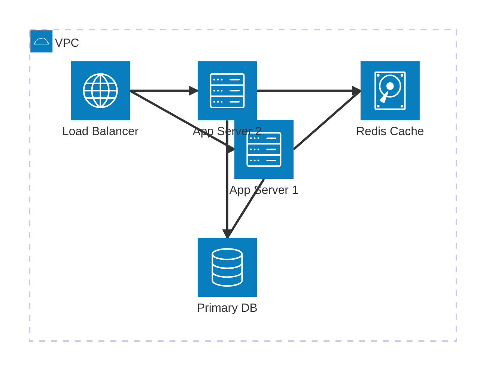

# architecture-beta — Syntax Reference

**Keyword:** `architecture-beta`

> ⚠️ **EXPERIMENTAL / DEV-ONLY** — This diagram type is only available in Mermaid development builds.
> It is **not present in the current stable Mermaid release**. It may not render in production environments.

> Note: The `-beta` suffix is **required**. `architecture` alone will not render.

Visualizes cloud/infrastructure topologies with services, groups, and edges.

## Building Blocks

### Groups
```
group {id}({icon})["Label With Spaces"]
group {id}({icon})["Label"] in {parent_group_id}
```

### Services
```
service {id}({icon})["Label With Spaces"]
service {id}({icon})["Label"] in {group_id}
```

> **Label rule**: labels inside `[]` that contain spaces or special characters **must** be wrapped in double quotes: `["My Service"]`. Single-word labels may omit quotes: `[API]`.

### Edges
```
serviceA:L -- R:serviceB          -- left of A to right of B (undirected)
serviceA:T --> B:serviceB         -- top of A to bottom of B (directed)
serviceA:R <-- L:serviceB         -- right of A from left of B (reverse)
```
Direction anchors: `T` top, `B` bottom, `L` left, `R` right

### Junctions
```
junction junctionId in groupId
```

## Available Icons
Common icons: `cloud`, `database`, `disk`, `server`, `internet`, `user`, `users`

## When to use `group` vs `service`

| Use `group` when... | Use `service` when... |
|---|---|
| representing a zone/cluster that **contains** other elements | representing a node you want to **connect with edges** |
| the element has no direct connections | the element is an endpoint of an arrow |

**Rule: only `service` nodes can appear in edges. `group` is purely a container.**

If you want to show a logical layer (e.g., "API Layer") that also receives connections, declare a **service** inside it — not the group itself.

```
# Pattern: layer as group + representative service inside
group api_layer(server)["API Layer"]
service api(server)["API Gateway"] in api_layer

# Then connect to the service, not the group:
client:R --> L:api   ✓
client:R --> L:api_layer   ✗  (groups are not valid edge endpoints)
```

## Example



## Pitfalls
- **`architecture` without `-beta` does NOT render** — always use `architecture-beta`
- **Groups CANNOT be edge endpoints** — this is the most common mistake. Every edge must reference a `service` ID, never a `group` ID:
  ```
  # WRONG — group used as edge endpoint:
  architecture-beta
      group api(server)["API Layer"]
      group db(database)["Database"]
      api:R --> L:db          ← INVALID: 'api' and 'db' are groups, not services

  # CORRECT — services inside groups, edges connect services:
  architecture-beta
      group api_layer(server)["API Layer"]
      group db_layer(database)["Database"]
      service api(server)["API"] in api_layer
      service db(database)["DB"] in db_layer
      api:R --> L:db
  ```
- **Edge syntax is `sourceId:ANCHOR --> ANCHOR:targetId`** — the destination anchor comes **BEFORE** the target ID:
  - WRONG: `api:R --> db:L`
  - CORRECT: `api:R --> L:db`
- **Default icons**: `cloud`, `database`, `disk`, `internet`, `server`. Use only these unless an iconify icon pack is explicitly registered. Do NOT assume `logos:aws-*` icons are available.
- **Labels with spaces MUST use double quotes**: `["My Label"]` — without quotes, multi-word labels cause parse errors
  - WRONG: `group ext(internet)[Camada Externa]`
  - CORRECT: `group ext(internet)["Camada Externa"]`
- **NEVER escape quotes with backslash**: use `["My Label"]` not `[\"My Label\"]`
- IDs must be declared before being referenced in edges
- Groups can be nested using `in parent_id`
