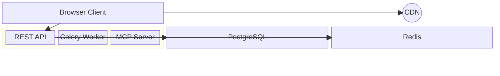

# block — Syntax Reference

**Keyword:** `block-beta`

Block diagrams give full manual control over component positioning, unlike flowcharts where layout is automatic.

> Note: The `-beta` suffix is **required**. `block` alone will not render.

> ⚠️ **PARSER IS FRAGILE — read the pitfalls before drafting.** Validate
> every draft with `mermaid_validate`. Prefer small, flat diagrams.

## Structure
```
block-beta
  columns N         -- set number of columns (default auto)
  A B C             -- blocks on same row
  A["Label"] B C    -- block with custom label
```

## Node Shapes
```
id            -- default rectangle
id["Label"]   -- rectangle with label (single line only)
id(("DB"))    -- circle (double parens)
id<["Arrow"]>(direction)  -- block arrow (direction: up/down/left/right)
```

> ❌ Do NOT put database-style `[("Label")]` or other composite shape
> brackets inside a composite `block:ID ... end` group — the parser mixes
> them with the group delimiters and fails. Use plain `id["Label"]` or a
> bare `id` inside groups.

## Block Arrows
```
id<["Label"]>(down)    -- arrow pointing down
id<["Label"]>(right)   -- arrow pointing right
```

## Composite Blocks (nested)
```
block-beta
  block:GROUP_ID
    A B C
  end
```
Notes:
- The outer `block-beta` does NOT take a trailing `end`.
- Only the inner `block:GROUP_ID ... end` uses `end`.
- Do NOT give the group an inline label like `block:GROUP_ID[Label]` —
  use a plain `block:GROUP_ID` and, if needed, a separate labelled child
  node inside the group.

## Edges
```
A --> B
C --> D
A -- B   -- undirected
```

## Spacing
```
space          -- empty cell (takes one column slot)
space:2        -- empty cells spanning 2 columns
```

## Styling
```
style id fill:#f9f,stroke:#333,stroke-width:2px
```

## ✅ Safe Example (validated)



## ❌ Anti-examples (DO NOT USE — parser breaks)

```
# ❌ Composite group with an inline label — breaks the parser
block:backend[Backend Services]
  API["REST API"]
end
```

```
# ❌ Database shape [("PostgreSQL")] inside or next to a composite group
block:backend
  API["REST API"]
end
Database[("PostgreSQL")]   # breaks when combined with the group above
```

```
# ❌ Multi-line labels with \n inside block-beta
Client["Browser\nClient"]   # fails to parse inside block-beta
```

## Pitfalls
- Keyword is `block-beta` — `block` alone does **not** render.
- `block-beta` is a TOP-LEVEL declaration; it does NOT need a closing `end`.
- Only nested `block:ID ... end` groups use `end`.
- Do NOT put labels on composite groups (`block:ID[Label]` is invalid).
- Avoid `[("...")]` (DB shape) and `[/.../]` (parallelogram) shapes inside
  composite groups — the parser mixes delimiters and fails.
- Labels cannot contain `\n` inside `block-beta` — keep them one line.
- Positioning is row-based; use `space` to push items to the right column.
- `columns N` only applies to the current block scope.
- When in doubt, flatten: drop composite groups and lay nodes out with
  `columns N` + `space`.

