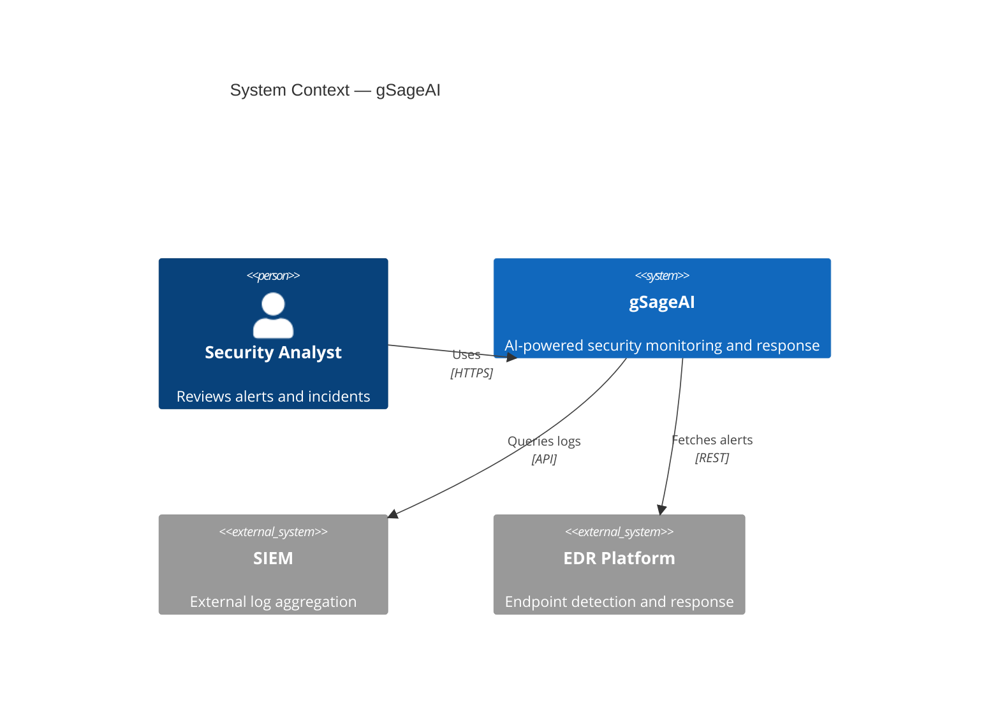
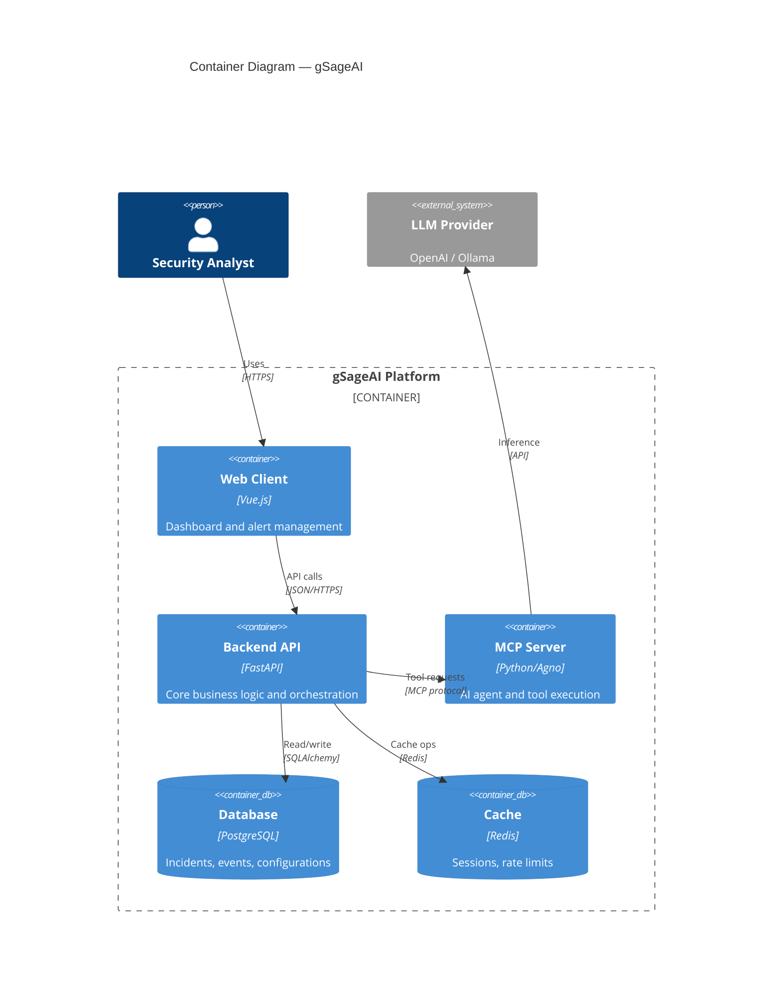

# c4 — Syntax Reference

**Keywords:** `C4Context`, `C4Container`, `C4Component`, `C4Dynamic`, `C4Deployment`

C4 diagrams follow the [C4 model](https://c4model.com/) (compatible with PlantUML C4). Each diagram type corresponds to a different level of architectural abstraction.

> Note: C4 diagrams use fixed styles. Different CSS themes will not affect their colors.

## Diagram Types

| Keyword | Level |
|---|---|
| `C4Context` | System context (people, systems) |
| `C4Container` | Containers inside a system (apps, DBs) |
| `C4Component` | Components inside a container |
| `C4Dynamic` | Dynamic interactions (numbered sequence) |
| `C4Deployment` | Deployment nodes and containers |

## Core Shapes (C4Context / C4Container)

```
Person(alias, "label", "?description")
Person_Ext(alias, "label", "?description")     -- external person

System(alias, "label", "?description")
System_Ext(alias, "label")                      -- external system
SystemDb(alias, "label", "?description")        -- database system
SystemQueue(alias, "label", "?description")     -- queue system
SystemDb_Ext(alias, "label")
SystemQueue_Ext(alias, "label")
```

## Boundaries

```
Enterprise_Boundary(alias, "label") { ... }
System_Boundary(alias, "label") { ... }
Boundary(alias, "label", "?type") { ... }
```

## Relationships

```
Rel(from, to, "label", "?technology")
BiRel(from, to, "label")                        -- bidirectional
Rel_U(from, to, "label")                        -- up
Rel_D(from, to, "label")                        -- down
Rel_L(from, to, "label")                        -- left
Rel_R(from, to, "label")                        -- right
Rel_Back(from, to, "label")                     -- reversed arrow
```

## Styling

```
UpdateElementStyle(alias, $fontColor="red", $bgColor="grey", $borderColor="red")
UpdateRelStyle(from, to, $textColor="blue", $lineColor="blue", $offsetX="5", $offsetY="-10")
UpdateLayoutConfig($c4ShapeInRow="3", $c4BoundaryInRow="1")
```

Parameters can use positional or named form:
```
UpdateRelStyle(customerA, bankA, "red", "blue", "-40", "60")
UpdateRelStyle(customerA, bankA, $offsetX="-40", $offsetY="60", $lineColor="blue", $textColor="red")
```

## C4Container Shapes

```
Container(alias, "label", "?technology", "?description")
ContainerDb(alias, "label", "?technology", "?description")
ContainerQueue(alias, "label", "?technology", "?description")
Container_Ext(alias, "label")
ContainerDb_Ext(alias, "label")
Container_Boundary(alias, "label") { ... }
```

## C4Component Shapes

```
Component(alias, "label", "?technology", "?description")
ComponentDb(alias, "label")
ComponentQueue(alias, "label")
Component_Ext(alias, "label")
```

## C4Deployment Shapes

```
Deployment_Node(alias, "label", "?type", "?description") { ... }
Node(alias, "label", "?type")            -- shorthand for Deployment_Node
Node_L(alias, "label", "?type")          -- left-aligned
Node_R(alias, "label", "?type")          -- right-aligned
```

## C4Dynamic

```
RelIndex(index, from, to, "label")       -- numbered interaction
```

## Example — System Context



## Example — Container Diagram



## Pitfalls
- Aliases must be unique within the diagram
- `UpdateElementStyle` and `UpdateRelStyle` must appear after all shapes are declared
- `Lay_U/D/L/R` layout hints are **not supported** — adjust order of statements to influence layout
- `sprite`, `tags`, and `link` parameters are listed but not yet fully implemented
- `BiRel` is directional visually; use it only when the relationship is truly bidirectional
