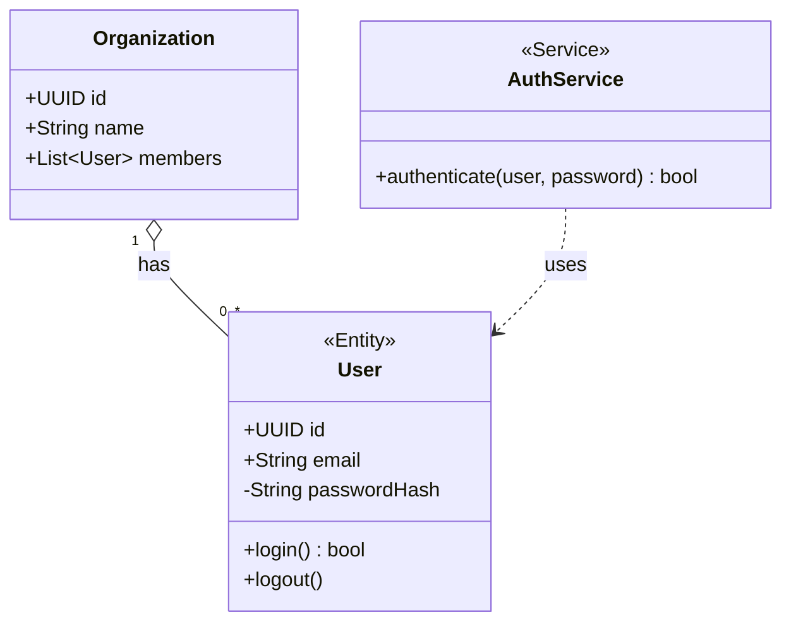

# classDiagram — Syntax Reference

**Keyword:** `classDiagram`

## Class Definition
```
class Animal {
    +String name
    -int age
    #String type
    ~int packageField
    +speak() String       -- return type after ()
    -eat(food)*           -- abstract method (*)
    +static() String$     -- static method ($)
}
```
Visibility: `+` public, `-` private, `#` protected, `~` package

## Labels and Generic Types
```
class Bucket~Item~        -- generic type parameter
class MyList["My Custom List"]  -- custom display label (backtick also works)
```

## Relationships
```
Animal <|-- Dog         -- inheritance (extends)
Dog *-- Paw             -- composition
Dog o-- Collar          -- aggregation
Dog --> Bone            -- association
Dog ..> Food            -- dependency
Dog ..|> Runnable       -- realization
Dog -- Cat              -- link (plain)
Dog <.. Cat             -- reverse dependency
Animal <|.. RunsAnimal  -- implements (reverse realization)
```

### Two-way Relations
```
Animal "0..*" --> "1" Owner
```

### Relation Labels
```
Animal "1" --> "0..*" Food : eats
```

## Annotations
```
class Service {
    <<Service>>
    +execute()
}
class MyInterface {
    <<Interface>>
}
class AbstractBase {
    <<Abstract>>
}
class Color {
    <<Enumeration>>
    RED
    GREEN
    BLUE
}
```

## Cardinality
```
Customer "1" --> "0..*" Order : places
```

## Namespace
```
namespace Animals {
    class Cat
    class Dog
}
```

## Direction
```
classDiagram
    direction LR
    class A
```

## Example



## Pitfalls
- Class names must be alphanumeric (plus underscore and dash). No spaces in class names.
- Use display label syntax for spaces: `` class A[`My Class`] `` or `class A["My Class"]`
- Generic types use `~`: `List~String~`
- Abstract methods use `*` suffix, static use `$` suffix
- `note "text"` adds a floating note; `note for ClassName "text"` attaches to a class
- Annotations use `<<AnnoName>>` inside the class body
- `direction` statement sets diagram layout direction
