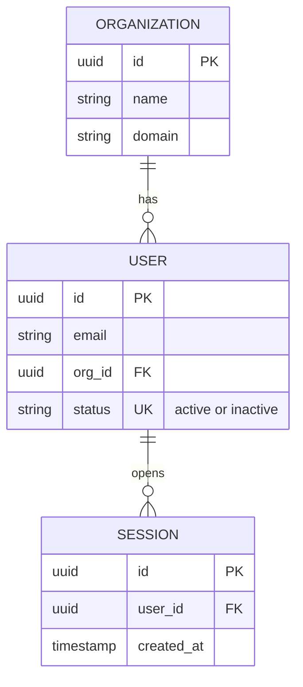

# erDiagram — Syntax Reference

**Keyword:** `erDiagram`

## Relationship Syntax
```
ENTITY1 RELATIONSHIP ENTITY2 : "label"
```

## Cardinality Symbols
```
|o  -- zero or one
||  -- exactly one
}o  -- zero or more
}|  -- one or more
```
Combined in pairs: left side -- right side of the line.

```
CUSTOMER ||--o{ ORDER : places
-- CUSTOMER has exactly one, ORDER has zero or more
```

Relationship line types:
- `--` solid line (identifying relationship)
- `..` dashed line (non-identifying relationship)

## Entity Aliases (v10.5+)
```
p[Person] {
    string firstName
    string lastName
}
a["Customer Account"] {
    string email
}
```

## Attributes (optional)
```
ENTITY {
    type name
    type name PK
    type name FK
    type name UK
    type name "comments here"
}
```

Key types: `PK` (primary key), `FK` (foreign key), `UK` (unique key)

## Example



## Pitfalls
- Entity names are typically uppercase (convention, not required)
- Relationship label is mandatory: must have `: "label"` or `: label`
- Attribute types are free text (no validation) — use your domain terms
- Names with spaces must be in plain double quotes: `"Entity Name"` — **NEVER** backslash-escaped `\"`
- Unicode is supported in entity names and attributes
- Attribute comments are added as a fourth field: `string email UK "must be unique"`
- Solid lines (`--`) represent identifying relationships; dashed lines (`..`) represent non-identifying
