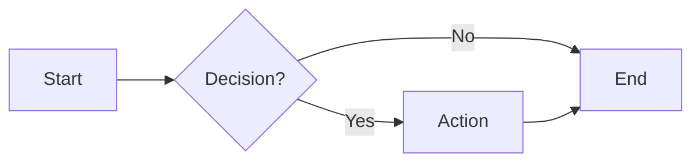
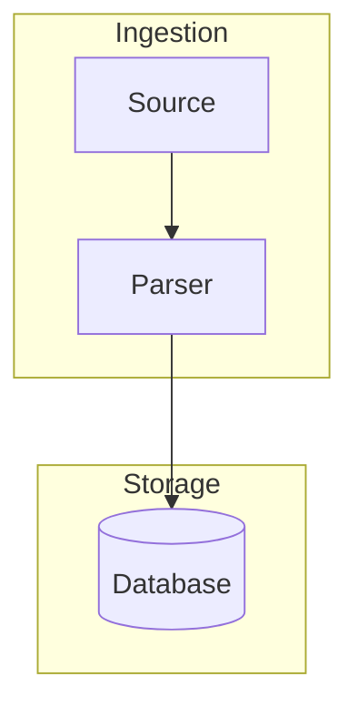

# flowchart — Syntax Reference

**Keyword:** `flowchart` (or `graph`)

## Direction
- `LR` — left to right
- `TD` / `TB` — top to bottom
- `RL` — right to left
- `BT` — bottom to top

## Node Shapes
```
id            -- default (rectangle)
id[text]      -- rectangle
id(text)      -- rounded rectangle
id((text))    -- circle
id{text}      -- diamond (decision)
id>text]      -- asymmetric (flag)
id[(text)]    -- cylinder (database)
id([text])    -- stadium/pill
id[[text]]    -- subroutine (double vertical bars)
id{{text}}    -- hexagon
id[/text/]    -- parallelogram
id[\text\]    -- parallelogram (reverse)
id[/text\]    -- trapezoid
id[\text/]    -- trapezoid (reverse)
```

## Markdown Strings
Use backticks for multi-line or formatted labels:
```
id["`**Bold** label
second line`"]
```

## Edge Types
```
A --> B           -- arrow
A --- B           -- line (no arrow)
A -.-> B          -- dotted arrow
A ==> B           -- thick arrow
A ~~~ B           -- invisible link (zero-length, for positioning)
A --text--> B     -- labeled arrow
A -->|text| B     -- alternate label syntax
A -- text --- B   -- labeled undirected
```

## Subgraphs
```
subgraph id [Title]
  direction LR
  A --> B
end
```

> Note: `direction` inside a subgraph overrides local layout direction, but may have limited effect on top-level nodes.

## Styling
```
style nodeId fill:#f9f,stroke:#333,stroke-width:2px
classDef myClass fill:#f9f,stroke:#333
class nodeA,nodeB myClass
nodeA:::myClass
```

## Examples





## Pitfalls
- The word `end` (lowercase) breaks the diagram. Use `End`, `END`, or wrap in quotes `"end"`
- Node IDs starting with `o` or `x` may create circle/cross edges — capitalise or prefix: `O_B`, `X_A`
- Use `"` to wrap labels with special characters or spaces: `id["some text"]`
- Subgraph IDs must be unique and not reuse node IDs
- Subgraph `direction` only affects internal layout; cross-subgraph edges follow parent direction
- The `elk` renderer (via `%%{init: {"flowchart": {"defaultRenderer": "elk"}}}%%`) improves complex layouts but requires elk plugin
