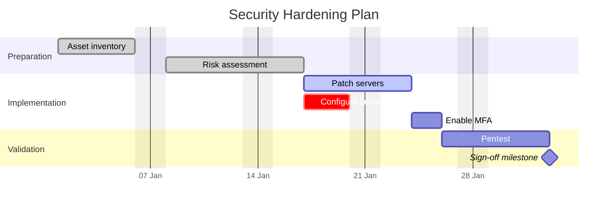

# gantt — Syntax Reference

**Keyword:** `gantt`

## Structure
```
gantt
    title Project Title
    dateFormat YYYY-MM-DD
    axisFormat %Y-%m
    tickInterval 1week
    excludes weekends
    excludes friday,saturday    -- custom weekend days (v11+)
    section Phase Name
        Task label : [tags,] [id,] start, duration
```

## Task Syntax
```
Task name : done, id1, 2024-01-01, 2024-01-05
Task name : active, id2, after id1, 3d
Task name : crit, id3, after id2, 5d
Milestone : milestone, m1, 2024-01-10, 0d
Future task : id4, after id3, 2d
Task until date : id5, 2024-01-01, until 2024-02-01   -- v10.9+
Task until milestone : id6, 2024-01-01, until m1       -- v10.9+
```

Valid tags: `done`, `active`, `crit`, `milestone` (optional, must come first in metadata)

## Date Formats
- `YYYY-MM-DD` (most common)
- `DD/MM/YYYY`, `MM/DD/YYYY`, etc.
- Duration: `1d`, `2w`, `3h`
- Relative start: `after taskId` (space-separated list of ids for multiple dependencies)

## axisFormat Options
```
axisFormat %Y-%m       -- 2024-01
axisFormat %d/%m       -- 15/01
axisFormat %b %d       -- Jan 15
```

## tickInterval Options
```
tickInterval 1day
tickInterval 1week
tickInterval 1month
```

## Compact Mode
```
%%{init: {"gantt": {"displayMode": "compact"}}}%%
gantt
    ...
```
Compact mode renders parallel tasks on the same row.

## Example



## Pitfalls
- `dateFormat` must be declared before tasks for dates to parse correctly
- Duration uses `d` (days), `w` (weeks), `h` (hours) — no spaces: `5d` not `5 d`
- Task IDs are used for `after` references — keep them unique across all sections
- `excludes weekends` shifts task end dates but does not create visual gaps
- `excludes friday,saturday` sets custom weekend days (v11+); `excludes friday` shifts the weekend to Fri-Sat
- `until` keyword (v10.9+) sets an absolute end date or end-at-milestone: `2024-01-01, until 2024-02-01`
- Colon `:` separates the task title from metadata — do not use `:` in task titles
- Multiple `after` dependencies: `after id1 id2 id3` (space-separated)
