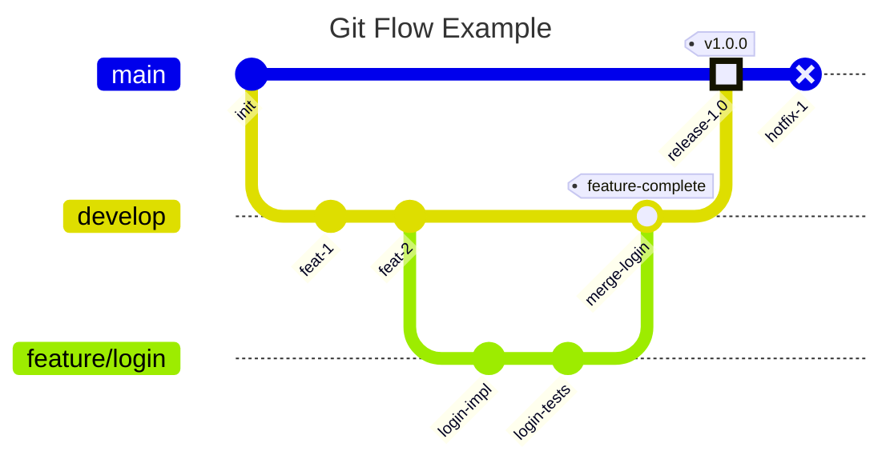
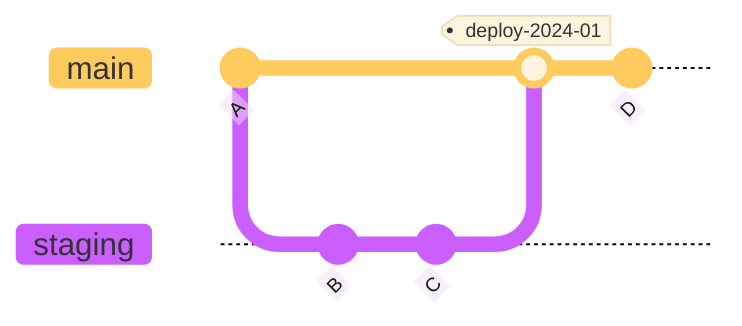

# gitgraph — Syntax Reference

**Keyword:** `gitGraph` (or `gitgraph`)

Visualizes Git commit history and branch operations as a graph.

## Core Operations

```
gitGraph
  commit                        -- commit on current branch (main by default)
  commit id: "Alpha"            -- commit with custom label
  commit type: HIGHLIGHT        -- highlighted commit (filled rectangle)
  commit type: REVERSE          -- reverse commit (crossed circle)
  commit tag: "v1.0.0"          -- add tag
  branch develop                -- create and switch to new branch
  checkout main                 -- switch to existing branch
  switch develop                -- alias for checkout
  merge develop                 -- merge branch onto current branch
  cherry-pick id: "X"           -- cherry-pick commit by id
```

## Commit Types

| Type | Description | Visual |
|---|---|---|
| `NORMAL` | Default | Solid circle |
| `REVERSE` | Reverse/rollback commit | Crossed circle |
| `HIGHLIGHT` | Notable commit | Filled rectangle |

## Branch Operations

```
branch feature/new-ui           -- create branch from current HEAD
branch "cherry-pick"            -- quote names that look like keywords
checkout main                   -- switch branch (sets current)
merge develop id: "m1" tag: "release" type: REVERSE
```

## Cherry-pick

```
cherry-pick id: "commit-id"
cherry-pick id: "MERGE_COMMIT_ID" parent: "PARENT_COMMIT_ID"
```

Rules:
- `id` must reference an existing commit
- Cherry-picked commit must be on a different branch than current
- When cherry-picking a merge commit, `parent` is mandatory

## Orientation

```
gitGraph LR:    -- left-to-right (default)
gitGraph TB:    -- top-to-bottom
gitGraph BT:    -- bottom-to-top (v11.0.0+)
```

## Configuration via Directives

```
%%{init: { 'gitGraph': {
    'showBranches': true,
    'showCommitLabel': true,
    'mainBranchName': 'main',
    'mainBranchOrder': 0,
    'parallelCommits': false,
    'rotateCommitLabel': true
} } }%%
gitGraph
  ...
```

| Option | Default | Description |
|---|---|---|
| `showBranches` | `true` | Show branch lines and labels |
| `showCommitLabel` | `true` | Show commit id labels |
| `mainBranchName` | `"main"` | Name of default/root branch |
| `mainBranchOrder` | `0` | Position order of main branch |
| `parallelCommits` | `false` | Show equidistant commits at same level |
| `rotateCommitLabel` | `true` | Rotate labels 45° for readability |

## Branch Ordering

```
gitGraph
  commit
  branch feature order: 1   -- explicit order position
  branch hotfix order: 2
```

- Main branch is always first (order 0) unless `mainBranchOrder` overrides it
- Branches without `order` appear in definition order
- Branches with `order` appear in numeric order after unordered branches

## Themes

```
%%{init: { 'theme': 'base' } }%%       -- base
%%{init: { 'theme': 'forest' } }%%     -- forest (green)
%%{init: { 'theme': 'dark' } }%%       -- dark
%%{init: { 'theme': 'default' } }%%    -- default (blue)
%%{init: { 'theme': 'neutral' } }%%    -- neutral (grey)
```

## Theme Variables (up to 8 branches, cyclic after that)

```
%%{init: { 'theme': 'default', 'themeVariables': {
    'git0': '#ff0000',
    'git1': '#00ff00',
    'gitBranchLabel0': '#ffffff',
    'commitLabelColor': '#ff0000',
    'commitLabelBackground': '#00ff00',
    'commitLabelFontSize': '16px',
    'tagLabelColor': '#ff0000',
    'tagLabelBackground': '#00ff00',
    'tagLabelBorder': '#0000ff',
    'gitInv0': '#ff0000'
} } }%%
```

## Example — Git Flow



## Example — With Config



## Pitfalls
- Branch names that are keywords must be quoted: `branch "cherry-pick"`, `branch "merge"`
- Cannot merge a branch with itself
- `cherry-pick` requires at least one commit on current branch
- After 8 branches, theme colors cycle back to the first branch color
- `Lay_U/D/L/R` layout hints from C4 do **not** exist here — use `TB:/LR:/BT:` orientation instead
- `switch` and `checkout` are interchangeable
