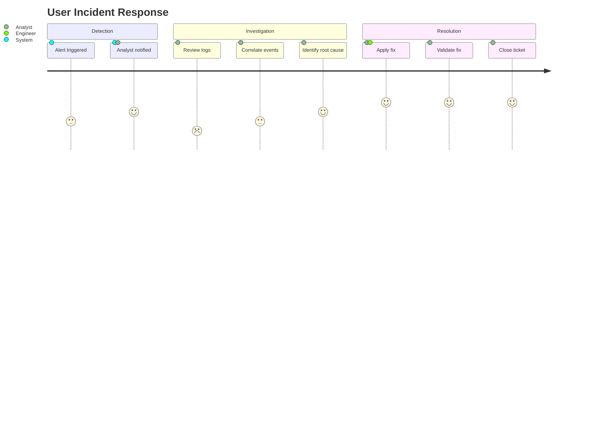

# journey — Syntax Reference

**Keyword:** `journey`

## Structure
```
journey
    title Title of the Journey
    section Section Name
        Task name: score: Actor1, Actor2
```

## Rules
- `title` — optional, displayed at top
- `section` — groups tasks into phases
- Each task: `Task name: <score>: <actors>`
  - `score` is an integer 1–5 (satisfaction level)
  - `actors` is a comma-separated list of participant names

## Example



## Pitfalls
- Score must be 1–5; values outside this range may render unexpectedly
- Actor names are free text; they appear in the legend
- Sections are optional but recommended for grouping
- No edge/arrow syntax — task order is strictly sequential within sections
