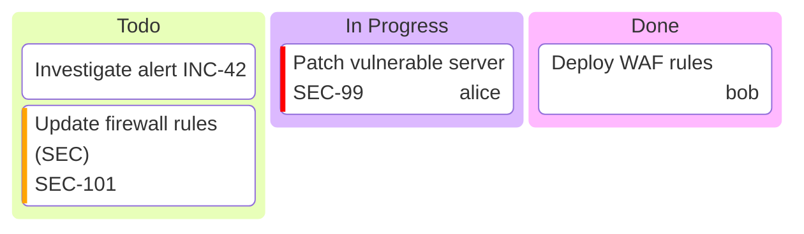

# kanban — Syntax Reference

**Keyword:** `kanban`

> ⚠️ **EXPERIMENTAL / DEV-ONLY** — This diagram type is only available in Mermaid development builds.
> It is **not present in the current stable Mermaid release**. It may not render in production environments.

## Structure
```
kanban
  columnId[Column Title]
    taskId[Task Description]
    taskId[Task Description]@{ metadata }
  columnId[Column Title]
    taskId[Task Description]
```

**Indentation is critical.** Tasks must be indented under their parent column.

## Column Syntax
```
todo[Todo]                            -- simple label
todo["Column title"]                  -- label with special chars
[In Progress]                         -- auto-ID (uses label as ID)
["In Progress / Active"]              -- auto-ID with special chars
```

**IMPORTANT:** Wrap column and task labels in **double quotes** inside brackets whenever the label contains special characters such as `/`, `(`, `)`, accented letters, or long descriptions. This prevents parsing errors.

```
-- CORRECT:
  t7["Price table GERAL/SaaS (commercial model)"]
  done["Concluded (Done)"]

-- WRONG (unquoted special chars):
  t7[Price table GERAL/SaaS (commercial model)]
```

## Task Syntax
```
t1[Fix login bug]                                         -- simple task
t2["Deploy hotfix"]@{ ticket: "INC-123" }                 -- quoted label + metadata
t3["Code review / PR"]@{ assigned: "alice", priority: "High" }  -- special chars in label
```

**IMPORTANT:** Metadata values MUST use **double quotes** (`"`), never single quotes (`'`).
Single quotes will cause rendering errors in most environments.

```
-- CORRECT:
t1[Task]@{ assigned: "alice", priority: "High" }
t2[Task]@{ ticket: "INC-42", data: "30/04" }

-- WRONG (single quotes — do NOT use):
t1[Task]@{ assigned: 'alice', priority: 'High' }
```

## Metadata Keys
- `assigned` — name of assignee (string, use double quotes: `"alice"`)
- `ticket` — ticket/issue ID (string, use double quotes: `"INC-42"`)
- `priority` — `"Very High"`, `"High"`, `"Low"`, `"Very Low"` (always double quotes)

## Ticket Links (optional config)
```
---
config:
  kanban:
    ticketBaseUrl: 'https://yourproject.atlassian.net/browse/#TICKET#'
---
kanban
  ...
```

## Example



## Pitfalls
- **Tasks MUST be indented** under their column — a task at column level becomes a column
- Use unique IDs for tasks and columns to avoid conflicts
- **Always wrap labels in double quotes** when they contain `/`, `(`, `)`, accents, or are long descriptions: `t1["My label (with parens)"]` ✅ / `t1[My label (with parens)]` ❌
- **Metadata values MUST use double quotes** (`"`), not single quotes: `@{ assigned: "alice" }` ✅ / `@{ assigned: 'alice' }` ❌
- If using `ticketBaseUrl`, the `#TICKET#` placeholder in the URL is replaced with the `ticket` value
