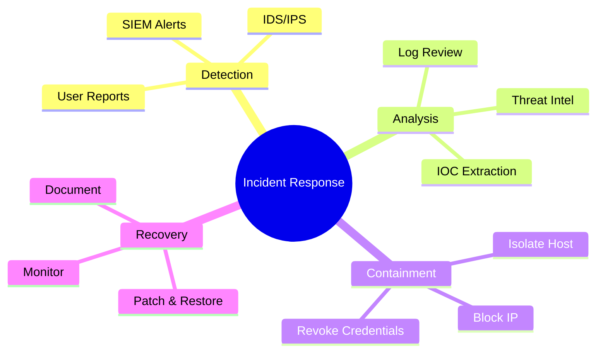

# mindmap — Syntax Reference

**Keyword:** `mindmap`

## Structure
Hierarchy is defined by **indentation** (spaces or tabs). The first unindented item is the root.

```
mindmap
  root((Root Label))
    Branch A
      Leaf A1
      Leaf A2
    Branch B
      Leaf B1
```

## Node Shapes
```
id            -- default (no shape, text only)
id[text]      -- square brackets → rectangle
id(text)      -- round brackets → rounded rectangle
id((text))    -- double parens → circle
id))text((    -- cloud shape
id)text(      -- bang / explosion shape
id[text]      -- rectangle (same as square)
```

## Icons and Classes
```
::icon(fa fa-cloud)    -- add FontAwesome icon to node
:::className           -- add CSS class to node
```

## Example



## Markdown Strings
Node labels support markdown formatting using backtick-quoted strings:
```
mindmap
  root("`**Bold Root**`")
    "`*Italic branch*`"
      "`Normal leaf`"
```

## Pitfalls
- **Exactly one root node** — multiple unindented items will cause an error
- Indentation must be consistent (spaces preferred over mixed tabs/spaces)
- Icons require FontAwesome to be loaded: `::icon(fa fa-cloud)`
- Markdown strings use backtick delimiters: `` `text` ``

- `::icon(...)` requires FontAwesome to be loaded in the rendering environment
- Node IDs are optional — shapes can be used without an explicit ID
- All text at the same indentation level becomes siblings
