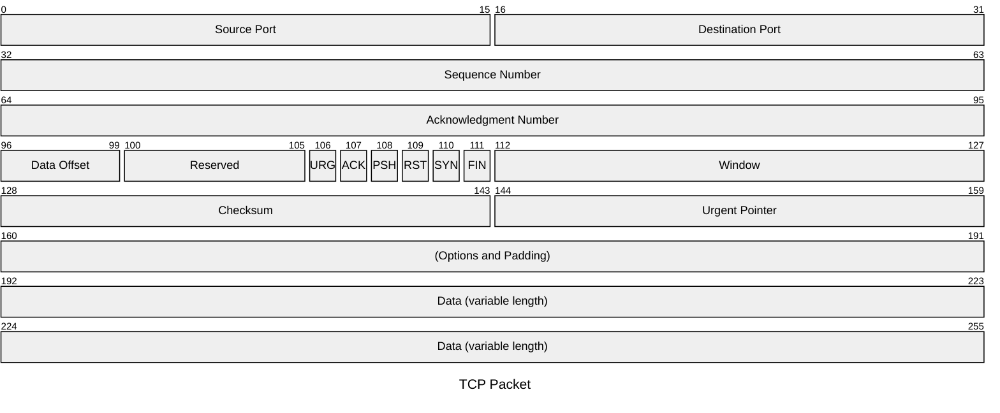
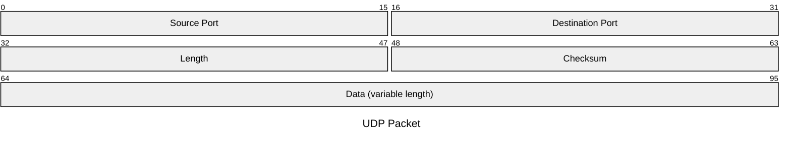

# packet — Syntax Reference

**Keyword:** `packet-beta`

Visualizes network packet structures and bit field layouts.

> Note: The `-beta` suffix is **required**. `packet` alone will not render.

## Structure
```
packet-beta
START-END: "Field Name"
```
or using bit-count syntax (v11.7.0+):
```
packet-beta
+BITS: "Field Name"
```

## Syntax Options

### Range syntax (explicit start/end bits)
```
0-15: "Source Port"
16-31: "Destination Port"
32-63: "Sequence Number"
```

### Bit-count syntax (auto-increments from last field end)
```
+16: "Source Port"
+16: "Destination Port"
+32: "Sequence Number"
```

Both can be mixed in the same diagram.

## Optional Config
```
---
title: "TCP Packet"
---
packet-beta
...
```

## Example





## Pitfalls
- **`packet-beta` does NOT exist** — use `packet`
- **`header`, `field`, `block`, `rows`, `bits` keywords do NOT exist** in packet syntax. Every line after `packet` must be either:
  - a range: `START-END: "Name"`
  - a bit-count: `+N: "Name"`
  - `title Optional Title`
- Field descriptions **must be in double quotes** to avoid parsing issues — use plain `"` characters, **NEVER** backslash-escaped `\"`
- Bit ranges must not overlap — each bit position can only be in one field
- Single-bit fields use a single number: `106: "URG"` (not `106-106`)
- Bit-count `+N` starts from where the previous field ended

### Wrong vs Correct
```
# WRONG — these keywords do not exist:
packet
    header "Header"
    field "Version" 4
    field "Length" 8

# CORRECT — range syntax:
packet
0-3: "Version"
4-11: "Length"

# CORRECT — bit-count syntax:
packet
+4: "Version"
+8: "Length"
```
