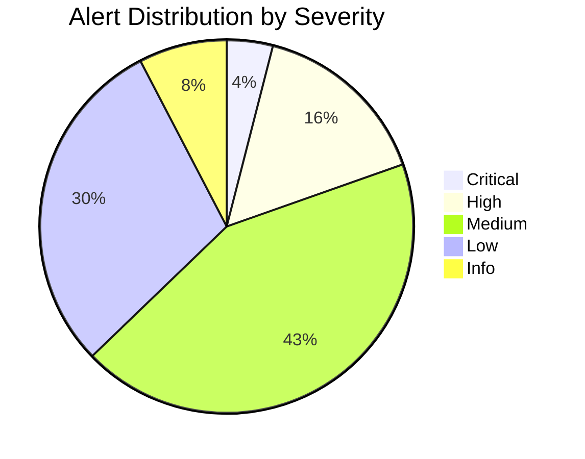
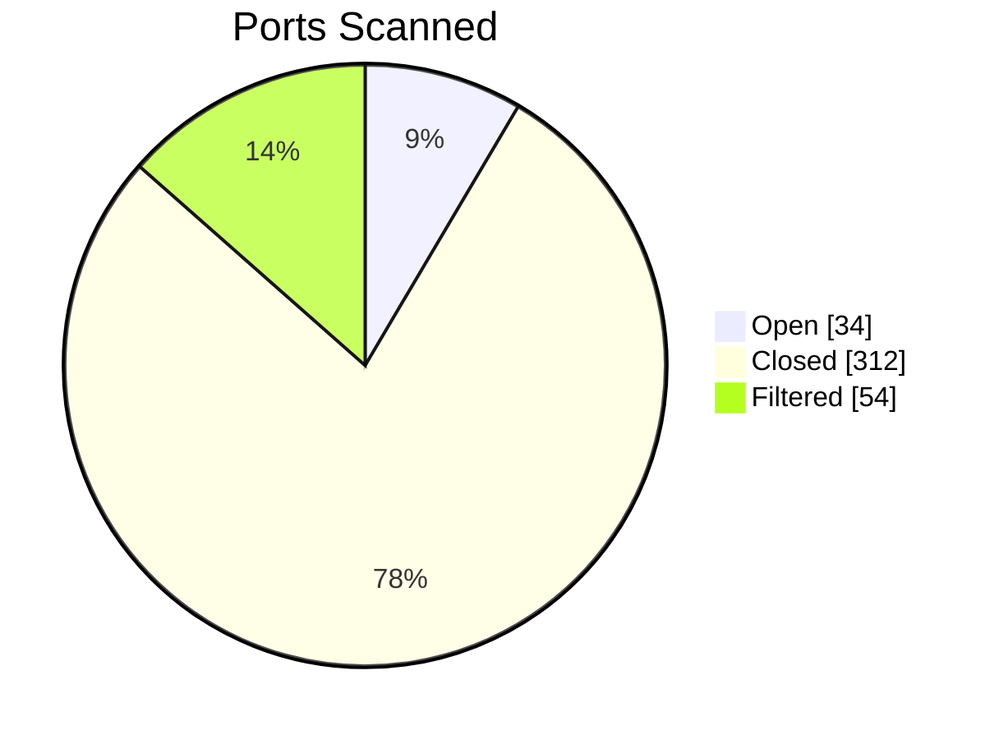

# pie — Syntax Reference

**Keyword:** `pie`

## Structure
```
pie [showData] [title "Title text"]
    "Label" : value
    "Label" : value
```

- `showData` (optional) — renders actual values after legend labels
- `title` (optional) — displayed at top
- Values must be **positive numbers** (integers or decimals, up to 2 decimal places)

## Example





## Configuration

```
%%{init: {"pie": {"textPosition": 0.5}}}%%
pie title Example
    "A" : 60
    "B" : 40
```

`textPosition` — float from 0.0 (center) to 1.0 (outer edge), default 0.75. Controls where percentage labels are placed.

## Pitfalls
- **Negative values are not allowed** and will cause a render error
- **Zero values are not allowed** — omit slices with zero
- Labels must be in plain double quotes — **NEVER** backslash-escaped `\"`; correct: `"Label"`
- Slices are ordered clockwise in the same order as declared
- No support for nested or multi-level pies
