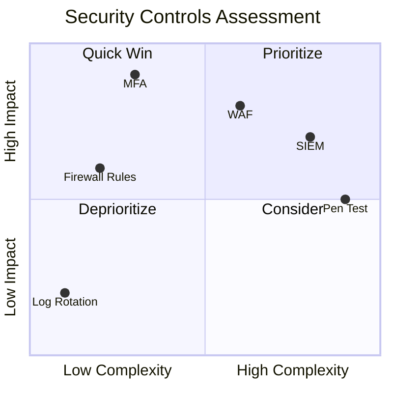

# quadrantChart — Syntax Reference

**Keyword:** `quadrantChart`

A quadrant chart plots data points on a 2D grid divided into four quadrants, commonly used to visualize priority, effort vs impact, risk vs value, etc.

## Structure

```
quadrantChart
    title "Chart Title"
    x-axis "Low Label" --> "High Label"
    y-axis "Low Label" --> "High Label"
    quadrant-1 Top Right Label
    quadrant-2 Top Left Label
    quadrant-3 Bottom Left Label
    quadrant-4 Bottom Right Label
    Point Name: [x, y]
```

## Axes

```
x-axis Low Reach --> High Reach    -- both labels (left and right)
x-axis Low Reach                   -- only left label
y-axis Low Engagement --> High Engagement  -- both labels (bottom and top)
y-axis Low Engagement              -- only bottom label
```

X and Y values for points range from **0.0 to 1.0**.

## Quadrant Labels

```
quadrant-1 We should expand      -- top right
quadrant-2 Need to promote        -- top left
quadrant-3 Re-evaluate            -- bottom left
quadrant-4 May be improved        -- bottom right
```

## Points

```
Campaign A: [0.3, 0.6]
Campaign B: [0.78, 0.34]
```

### Point Styling (inline)

```
Point A: [0.9, 0.0] radius: 12
Point B: [0.8, 0.1] color: #ff3300, radius: 10
Point C: [0.7, 0.2] radius: 25, color: #00ff33, stroke-color: #10f0f0
Point D: [0.6, 0.3] radius: 15, stroke-color: #00ff0f, stroke-width: 5px, color: #ff33f0
```

| Style property | Description |
|---|---|
| `color` | Fill color of the point |
| `radius` | Radius of the point circle |
| `stroke-width` | Border width |
| `stroke-color` | Border color (only effective with stroke-width) |

### Point Styling (classDef)

```
Point A:::class1: [0.9, 0.0]
Point B:::class2: [0.8, 0.1]
classDef class1 color: #109060
classDef class2 color: #908342, radius: 10, stroke-color: #310085, stroke-width: 10px
```

Style priority: inline styles > classDef > theme variables.

## Configuration

```
%%{init: {"quadrantChart": {"chartWidth": 400, "chartHeight": 400}} }%%
quadrantChart
  ...
```

| Parameter | Default | Description |
|---|---|---|
| `chartWidth` | 500 | Chart width in px |
| `chartHeight` | 500 | Chart height in px |
| `titleFontSize` | 20 | Title font size |
| `quadrantLabelFontSize` | 16 | Quadrant text font size |
| `pointRadius` | 5 | Default point radius |
| `xAxisPosition` | `'top'` | X-axis position (when no points: top; with points: always bottom) |
| `yAxisPosition` | `'left'` | Y-axis position |

## Theme Variables

```
%%{init: { "themeVariables": {"quadrant1Fill": "#e8f4f8", "quadrantPointFill": "#ff6b6b"} } }%%
```

Available: `quadrant1Fill`, `quadrant2Fill`, `quadrant3Fill`, `quadrant4Fill`,
`quadrant1TextFill`, `quadrant2TextFill`, `quadrant3TextFill`, `quadrant4TextFill`,
`quadrantPointFill`, `quadrantPointTextFill`, `quadrantXAxisTextFill`, `quadrantYAxisTextFill`,
`quadrantTitleFill`, `quadrantInternalBorderStrokeFill`, `quadrantExternalBorderStrokeFill`.

## Example



## Pitfalls
- X and Y values must be between **0.0 and 1.0** (not percentages)
- `quadrant-1` is top-right, `quadrant-2` is top-left, `quadrant-3` is bottom-left, `quadrant-4` is bottom-right
- When no data points exist, axis labels render in the center of their axis quadrant
- When data points exist, x-axis labels always move to the bottom regardless of `xAxisPosition`
- Inline styles take precedence over classDef styles
