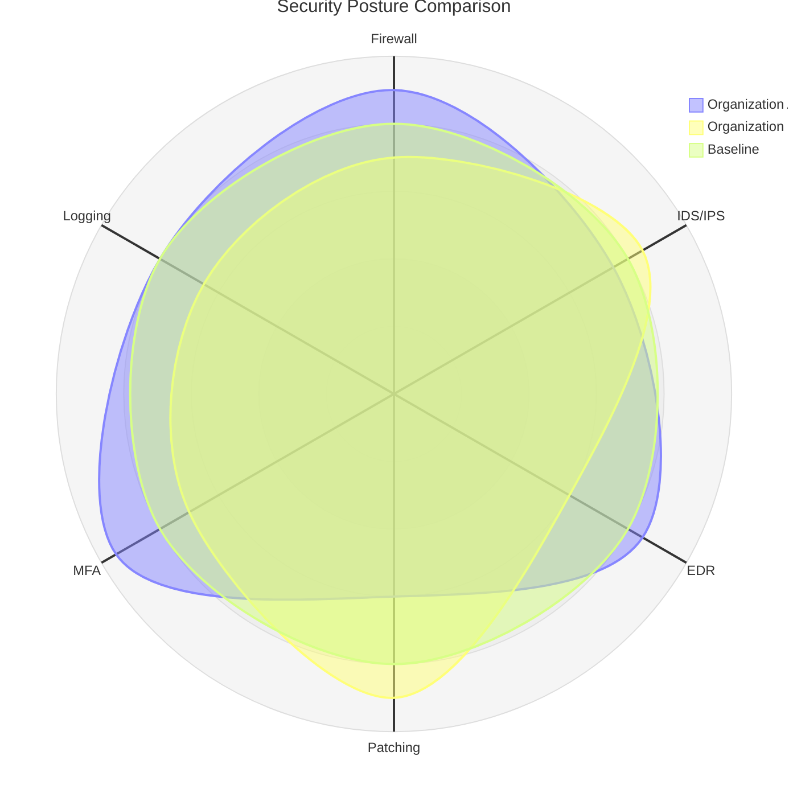

# radar-beta — Syntax Reference

**Keyword:** `radar-beta`

> ⚠️ **EXPERIMENTAL / DEV-ONLY** — This diagram type is only available in Mermaid development builds.
> It is **not present in the current stable Mermaid release**. It may not render in production environments.

Radar (spider/cobweb) chart for multi-dimensional comparison of multiple entities.

## Structure
```
radar-beta
  title Optional Title
  axis id1["Label1"], id2["Label2"], id3["Label3"]
  axis id4["Label4"]
  curve entity1["Entity Name"]{v1, v2, v3, v4}
  curve entity2["Entity Name"]{v1, v2, v3, v4}
  max 100
  min 0
  graticule polygon   -- or 'circle' (default)
```

## Rules
- Each `axis` line defines one or more axes (dimensions)
- Each `curve` line defines one entity's data points
- Values in `{}` must match the **number of axes defined** (in order)
- Alternatively, use key-value pairs: `{axis1: 80, axis2: 60, axis3: 90}`
- `max` and `min` set the scale bounds
- `graticule polygon` renders grid as polygon; `graticule circle` as circles

## Example



## Pitfalls
- **`radar` without `-beta` does NOT render** — always use `radar-beta`
- **`axes` (plural) does NOT exist** — always use `axis` (singular)
- **`data [...]` does NOT exist** — values belong inside `curve`, never in a `data` block
- **`axis [Label1, Label2]` square-bracket list format is WRONG** — correct:
  - bare IDs: `axis A, B, C` (no labels)
  - labelled IDs: `axis a["Label A"], b["Label B"]`
- **`curve` requires an ID** — minimum form: `curve c1{1, 2, 3}`. Label is optional: `curve c1["Name"]{1, 2, 3}`
- Number of values per curve must exactly match total number of axes defined
- Axis IDs must be unique
- Labels with spaces must be in double quotes: `axis id["My Label"]`
- **NEVER escape quotes with backslash** — `axis fw[\"Firewall\"]` is WRONG; use `axis fw["Firewall"]` (plain double quotes, no backslash)
- If key-value syntax is used in curves, axis IDs must match exactly

### Wrong vs Correct
```
# WRONG — do not do this:
radar-beta
  axes [Acesso, Logs, Patching]
  data [4, 3, 4]

# CORRECT:
radar-beta
  axis acc["Acesso"], logs["Logs"], patch["Patching"]
  curve c1["Org A"]{4, 3, 4}
```
