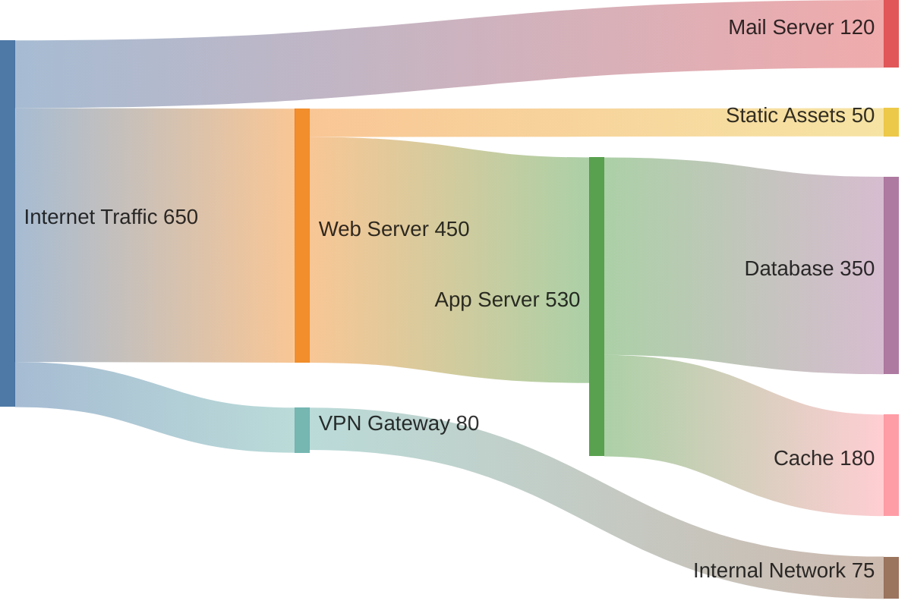
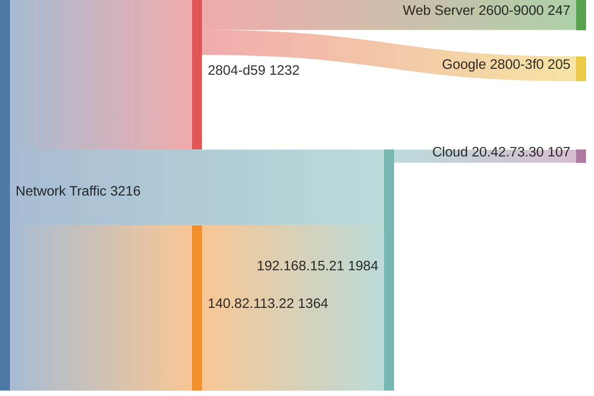

# sankey — Syntax Reference

**Keyword:** `sankey-beta`

Sankey diagrams visualize flows and their quantities between nodes (CSV-like format).

> Note: The `-beta` suffix is **required**. `sankey` alone will not render.

## Structure
```
sankey-beta
SOURCE,DESTINATION,VALUE
SOURCE,DESTINATION,VALUE
```

Each line is: `source node name,destination node name,numeric value`

## Optional Config Block
```
---
config:
  sankey:
    showValues: false   -- hide numeric labels on flows
    width: 800
    height: 400
    linkColor: "source" -- or "target", "gradient"
    nodeAlignment: "justify"  -- or "left", "right", "center"
---
sankey-beta
A,B,10
```

## Example — Generic Flow



## Example — Network Traffic (IPs)



> Note: bidirectional flows from the raw data (`Google ↔ 2804-d59`, `192.168.15.21 ↔ 140.82.113.22`) were removed to prevent cycle errors. Only the dominant direction is shown.

## Pitfalls
- **NEVER use accented or special characters** in node names — they break rendering
  - Bad: `São Paulo,Destino,10` → Good: `Sao Paulo,Destino,10`
- **Commas inside node names must be quoted**: `"Node, Name",Target,10`
- **Colons (`:`) in node names break the CSV parser** — replace with a space-hyphen or abbreviate
  - Bad: `2804:d59::1,Target,10` → Good: `2804-d59,Target,10`
- **Dots (`.`) are safe** — do NOT replace them with underscores
  - Bad: `192_168_15_21,Target,10` → CORRECT: `192.168.15.21,Target,10`
  - Bad: `140_82_113_22` → CORRECT: `140.82.113.22`
- Values must be **positive numbers** — zero or negative will cause errors
- Node names are case-sensitive — `Web Server` and `web server` are two different nodes
- Empty lines are allowed for visual separation (ignored by parser)
- The diagram is always directed (flows go from source to destination)

## ⚠️ NO CYCLES — Bidirectional flows will break the diagram

Sankey diagrams use a DAG (Directed Acyclic Graph). **Cycles cause a render failure.** A cycle occurs when node A flows to node B AND node B flows back to node A (directly or indirectly).

**BROKEN — has cycles:**
```
sankey-beta
Network Traffic,IPv6-Client,1232
IPv6-Client,Google-IPv6,205
Google-IPv6,IPv6-Client,205     ← CYCLE: IPv6-Client ↔ Google-IPv6
Network Traffic,GitHub,1364
GitHub,Client-A,1364
Client-A,GitHub,163             ← CYCLE: GitHub ↔ Client-A
```

**FIXED — merge bidirectional flows into net or one-directional:**
```
sankey-beta
Network Traffic,IPv6-Client,1232
IPv6-Client,Google-IPv6,205
IPv6-Client,Cloud-Server,247
Network Traffic,GitHub,1364
GitHub,Client-A,1201
Client-A,Cloud-Server,107
```

**Rules to avoid cycles:**
1. A node CAN appear as both a destination and a source — that is normal for "through" nodes.
2. A cycle only occurs when following flows you can arrive back at a node you already visited.
3. For real bidirectional traffic, show only the dominant direction, or subtract and show net flow, or split into `A-to-B` and `B-to-A` nodes.
4. If removing a link would break the business meaning, consider using a `sequenceDiagram` or `flowchart` instead.

## Network/Traffic Data Guidelines
When representing network traffic, hosts, or IP flows:
- **IPv4 addresses**: use literal dot notation — `192.168.1.1`, `140.82.113.22`
- **IPv6 addresses**: colons are forbidden — abbreviate to the significant octets with hyphens: `2804:d59::` → `2804-d59`; or use a readable label like `IPv6-Client`
- **Ports**: omit the port or use a label — `Web Server :443` → `Web Server HTTPS`
- **Hostnames / domains**: dots are fine — `api.example.com,Backend,100`
- **Prefer human-readable labels** over raw IPs when the context allows: `GitHub CDN` instead of `140.82.113.22`
- **Scan the data for cycles before generating**: for each node that appears as a source, check if it also appears as a destination of any of its own destinations (directly or transitively). If so, break the cycle using one of the strategies above.
