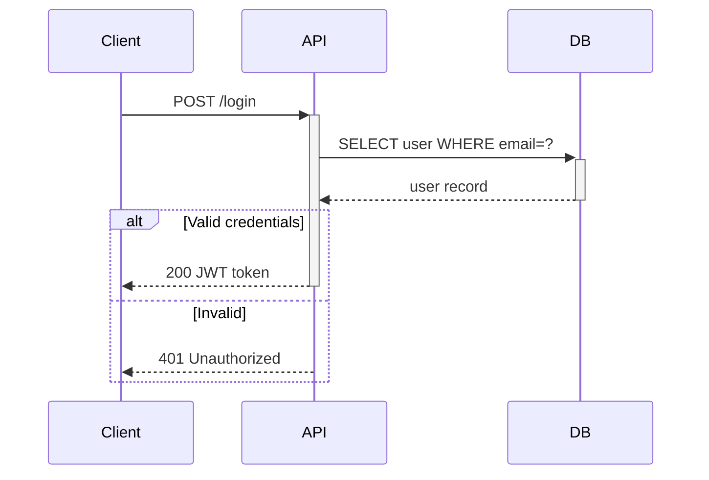

# sequenceDiagram — Syntax Reference

**Keyword:** `sequenceDiagram`

## Participants
```
participant Alice
participant A as "Alice"        -- alias
actor Bob                        -- renders as stick figure
actor B as "Bob"                 -- actor with alias
create participant Carol         -- create mid-diagram (v10.3+)
create actor Dan                 -- create actor mid-diagram (v10.3+)
destroy Carol                    -- remove participant mid-diagram (v10.3+)
```

## Message Arrows
```
Alice->>Bob: text       -- solid arrowhead (async request)
Alice-->>Bob: text      -- dotted arrowhead (async reply)
Alice->Bob: text        -- solid line, no arrowhead (sync)
Alice-->Bob: text       -- dotted line, no arrowhead
Alice-)Bob: text        -- open async arrow
Alice--)Bob: text       -- dotted open async arrow
Alice-xBob: text        -- cross at Bob (destroy/X)
Alice--xBob: text       -- dotted cross
Alice<<->>Bob: text     -- bidirectional (v11+)
Alice<<-->>Bob: text    -- bidirectional dotted (v11+)
```

## Activation Bars
```
activate Alice
deactivate Alice
-- shorthand: Alice->>+Bob: msg / Bob-->>-Alice: reply
```

## Notes
```
Note right of Alice: text
Note left of Bob: text
Note over Alice,Bob: text
```

## Auto-numbering
```
autonumber           -- prefix messages with sequence numbers
autonumber 10        -- start from 10
autonumber 10 5      -- start from 10, increment by 5
```

## Grouping / Box
```
box Title
  participant Alice
  participant Bob
end

box rgba(0,128,255,0.1) "Group Title"
  participant Alice
end
```

## Control Structures
```
loop Every minute
    Alice->>Bob: ping
end

alt Success
    Bob-->>Alice: 200 OK
else Error
    Bob-->>Alice: 500
end

opt Optional step
    Alice->>Alice: self call
end

par Parallel A
    Alice->>Bob: task1
and Parallel B
    Alice->>Carol: task2
end

critical Establish connection
    Alice->>Bob: connect
option Timeout
    Alice->>Alice: retry
option Network error
    Alice->>Alice: log failure
end

break On error
    Alice->>Alice: abort flow
end
```

## Background Highlighting
```
rect rgb(0, 255, 0)
    Alice->>Bob: highlighted section
end
```

## Example



```mermaid
sequenceDiagram
    autonumber
    actor User
    participant Auth
    create participant Session

    User->>Auth: POST /login
    Auth->>Session: create session
    Auth-->>User: 200 + token

    rect rgb(255, 200, 200)
        note over User,Auth: Error path
        User->>Auth: POST /login (wrong pw)
        Auth-->>User: 401
    end

    destroy Session
    User->>Auth: DELETE /logout
    Auth->>Session: destroy session
```

## Pitfalls
- The word `end` (lowercase) in participant names or messages will break the diagram. Use `(end)`, `[end]`, or `{end}`
- Arrow type affects semantics: `->>` / `-->>` = async request/reply; `->` / `-->` = sync
- `activate`/`deactivate` must be balanced; mismatches cause render errors
- `create participant` must appear before the created participant sends/receives any messages
- `<<->>` bidirectional arrows require Mermaid v11+
- `critical` blocks are for required conditions; `option` is like `else` for critical
