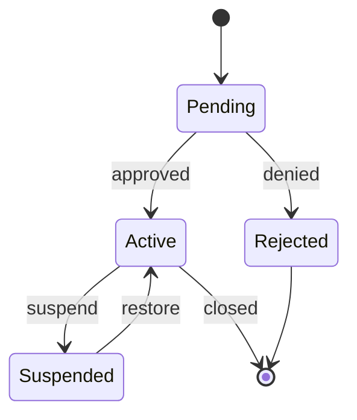

# stateDiagram-v2 — Syntax Reference

**Keyword:** `stateDiagram-v2` (prefer over `stateDiagram`)

## States
```
StateId                       -- simple state
state "Label text" as StateId -- state with description
StateId : Label text          -- alternate label syntax
```

## Transitions
```
[*] --> Idle        -- initial state
Idle --> [*]        -- final state
Idle --> Running    -- transition
Idle --> Running : event label
```

## Composite States (nested)
```
state Running {
    [*] --> Executing
    Executing --> Paused
}
```

## Fork / Join (concurrent)
```
state fork_state <<fork>>
state join_state <<join>>
[*] --> fork_state
fork_state --> A
fork_state --> B
A --> join_state
B --> join_state
join_state --> [*]
```

## Choice (conditional branch)
```
state checkLogin <<choice>>
[*] --> checkLogin
checkLogin --> LoggedIn : if authenticated
checkLogin --> LoginPage : if not authenticated
```

## Concurrency (parallel regions)
```
state Active {
    [*] --> Monitor
    --
    [*] --> Logging
}
```

## Direction
```
stateDiagram-v2
    direction LR
    [*] --> A
```

## Notes
```
note right of StateId
    This is a note
end note
```

## Example



## Pitfalls
- Use `stateDiagram-v2` for best rendering (v1 has visual differences)
- The word `end` (lowercase) in state names breaks parsing
- `<<fork>>` and `<<join>>` enable concurrent flows (parallel states)
- `<<choice>>` creates a conditional branch node
- `--` separates concurrent regions inside a composite state
- `direction LR` sets layout direction (also works inside composite states)
