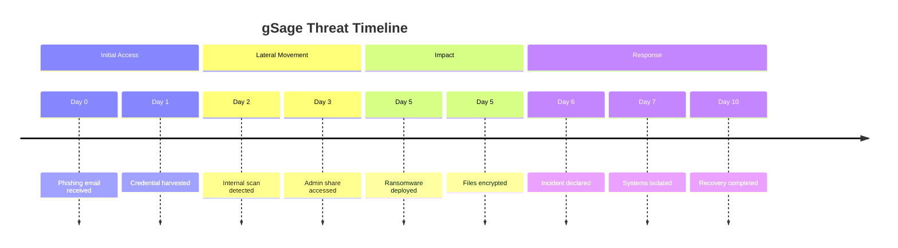

# timeline — Syntax Reference

**Keyword:** `timeline`

## Structure
```
timeline
    title Optional Title
    section Optional Section Name
        Time Period : Event
        Time Period : Event 1 : Event 2
        Time Period : Event
                    : More events on same period
```

## Rules
- `title` — optional, displayed at top
- `section` — optional grouping; all subsequent entries belong to it until next section
- Time periods and events are **plain text** — no strict format required
- Multiple events on the same period: repeat the period or use `:` continuation
- Direction: always left to right (chronological order of declaration)

## Example



## Pitfalls
- **Do NOT use `:` in time period labels** — it is the delimiter and will break parsing
  - Bad: `12:00 PM : Event` → Good: `1200h : Event`
- Events are free text; they render as bubbles on the timeline
- Sections group entries visually with a colored band
- No numeric or date validation — purely decorative chronology
- Each section gets a different colour automatically; to disable this use `disableMulticolor`:
  ```
  %%{init: {"timeline": {"disableMulticolor": true}}}%%
  ```
- Theme variables `cScale0` through `cScale11` control section colors:
  ```
  %%{init: {"themeVariables": {"cScale0": "#ff0000", "cScale1": "#00ff00"}}}%%
  ```
