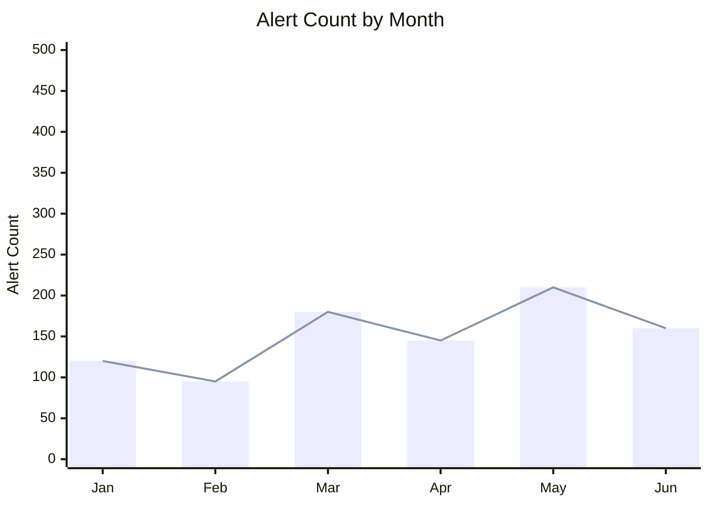
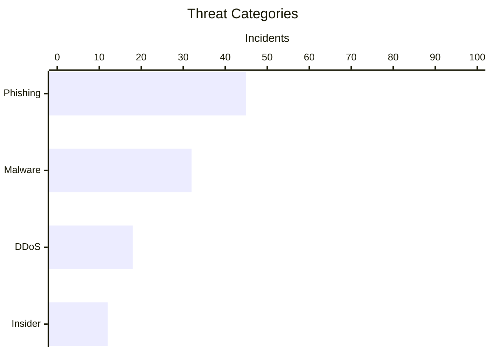

# xychart — Syntax Reference

**Keyword:** `xychart-beta`

> Note: The `-beta` suffix is **required**. `xychart` alone will not render.

Supports bar charts and line charts with numeric or categorical axes.

## Structure
```
xychart-beta [horizontal]
    title "Chart Title"
    x-axis [cat1, cat2, cat3]
    y-axis "Y Label" min --> max
    bar [v1, v2, v3]
    line [v1, v2, v3]
```

## Axes
```
x-axis [jan, feb, mar]            -- categorical labels
x-axis "Label" 0 --> 100          -- numeric range
y-axis "Revenue ($)" 0 --> 10000  -- numeric range (mandatory for y)
y-axis "Label"                    -- auto-range from data
```

## Series
```
bar [10, 20, 15, 25]   -- bar chart series
line [10, 20, 15, 25]  -- line chart series
```
Multiple `bar` and `line` entries can be combined.

## Orientation
```
xychart-beta horizontal     -- flips axes
```

## Example





## Pitfalls
- **`barChart` does NOT exist** — use `xychart-beta`
- **`xychart` without `-beta` does NOT render** — always use `xychart-beta`
- Multi-word labels must be in quotes: `"Sales Revenue"` not `Sales Revenue`
- Number of values in `bar`/`line` must match number of x-axis categories
- `y-axis` range is optional but recommended to avoid auto-scaling surprises
- `horizontal` keyword reverses x/y visual roles
