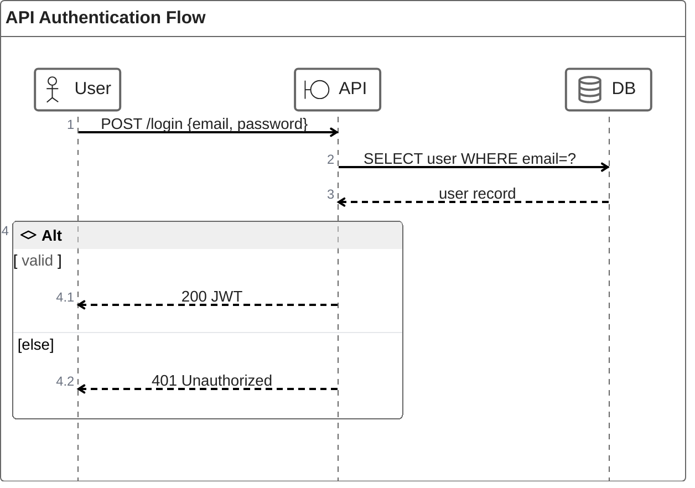

# zenuml — Syntax Reference

**Keyword:** `zenuml`

ZenUML is an alternative sequence diagram syntax. Different from `sequenceDiagram`.

> 🚫 **DO NOT USE IN gSage.** The gSage web client does NOT bundle the
> `zenuml` Mermaid plugin, so diagrams of this type render as blank.
> **Always use `sequenceDiagram` instead** — it covers the same use cases
> and renders natively. This reference is kept only for completeness.

## Structure
```
zenuml
    title Optional Title
    ParticipantA->ParticipantB: Message
    ParticipantB->ParticipantA: Reply
```

## Participants & Annotations
```
Alice              -- implicit declaration
@Actor Alice       -- stick figure
@Database Bob      -- database icon
@Boundary C        -- boundary symbol
@Control D         -- control symbol
@Entity E          -- entity symbol

A as Alice         -- alias: use 'A' as shorthand for 'Alice'
```

## Message Types
```
A->B: message      -- sync call (solid arrow)
A-->B: message     -- async message (dotted)
new B(args)        -- creation message
```

## Method Calls
```
A.methodName
A.methodName(param1, param2) {
    B.nestedCall
}
```

## Loops and Conditions
```
while (condition) {
    A->B: looping
}

if (condition) {
    A->B: true path
} else {
    A->B: false path
}
```

## Example



## Pitfalls
- ZenUML syntax is **different from `sequenceDiagram`** — do not mix them.
- Many Mermaid renderers (including the gSage web client) do NOT ship the
  `zenuml` plugin. Even a valid diagram may render as blank. When in
  doubt, use `sequenceDiagram` instead.
- No `participant` keyword — declare using annotations or implicit usage.
- Nested blocks (`{}`) must be properly closed.
- `-->` is async in zenuml (same visual as dotted line).
